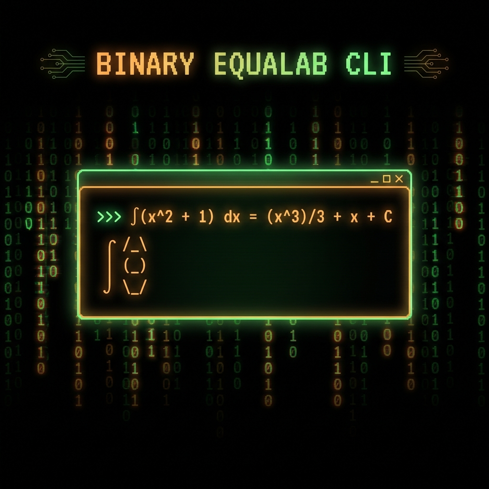

# Binary EquaLab

<p align="center">
  
</p>

<p align="center">
  <em>"Las matemáticas también sienten, pero estas no se equivocan."</em>
  <br>
  <small>Aurora v3.1</small>
</p>

<p align="center">
  <a href="#web">🌐 Web</a> •
  <a href="#desktop">💻 Desktop</a> •
  <a href="#cli">⌨️ CLI</a> •
  <a href="#features">🔢 Features</a> •
  <a href="#installation">📦 Installation</a>
</p>

---

## 🌟 About

**Binary EquaLab** is a professional Computer Algebra System (CAS) with support for Spanish mathematical functions. It's available in three flavors:

| Platform    | Description               | Tech Stack                          |
| ----------- | ------------------------- | ----------------------------------- |
| **Web**     | Full-featured browser app | React + Vite + FastAPI + SymEngine   |
| **Desktop** | Native application        | Tauri + React + Rust                 |
| **CLI**     | Command-line REPL + TUI   | Python + SymEngine + SymPy + Rich    |
| **Engine**  | C++ native math core      | C++20 + pybind11 + Eigen3            |

> **⚠️ AVISO IMPORTANTE (DISCLAIMER MÉDICO)**: Binary EquaLab y el sub-proyecto *Séptima Bio-Engine* son herramientas estrictamente con fines **educativos** y de demostración de arquitectura de software. Los modelos biomédicos aquí presentados (como el Hodgkin-Huxley, Farmacocinética de 1 Compartimento, Windkessel y Púrpura Trombocitopénica Inmune) funcionan exclusivamente en base a aproximaciones matemáticas teóricas (Euler, Runge-Kutta 4) y análisis de LLMs. **Este software NO está certificado por ninguna entidad de salud (FDA/EMA) y BAJO NINGUNA CIRCUNSTANCIA debe utilizarse para diagnósticos, dosificación de tratamientos, ni tomas de decisiones clínicas reales.**

---

## ✨ Features

### 🧮 CAS Calculator (64 functions)
- **Spanish functions**: `derivar()`, `integrar()`, `resolver()`, `factorizar()` + 60 more
- **Derivatives**: `derivar(x^3 + 2x, x)` → `3x² + 2`
- **Integrals**: `integrar(sin(x), x)` → `-cos(x)`
- **Limits**: `limite(sin(x)/x, x, 0)` → `1`
- **Taylor series**: `taylor(sin(x), x, 0, 5)` → `-x³/6 + x`
- **Number theory**: `esPrimo(97)`, `mcd(24,36)`, `factoresPrimos(360)`
- **Statistics**: `media()`, `covarianza()`, `correlacion()`, `regresion()`, `normalpdf()`, `binomialpmf()`
- **Scripting**: `f(x) := x^2 + 1; f(3)` → `10`

### 📊 8 Modes
| Mode                | Features                             |
| ------------------- | ------------------------------------ |
| **Calculadora CAS** | Full symbolic computation            |
| **Gráficas**        | 2D plotting + Epicycles PRO          |
| **Ecuaciones**      | Single, systems, inequalities        |
| **Matrices**        | Operations, determinants, inverse    |
| **Estadística**     | Descriptive, regression, probability |
| **Complejos**       | Operations + Argand diagram          |
| **Vectores**        | 2D/3D + visualization                |
| **Contador PRO**    | VAN, TIR, depreciation, interest     |

### 🎨 Epicycles PRO
- Draw custom shapes → Fourier transform
- Catmull-Rom line smoothing
- Parametric function input: `x = cos(t); y = sin(2*t)`
- Templates: heart, star, infinity, spiral
- Glow trail effects

### 🔢 Number Systems
- **Binary**: `0b1010` → `10`
- **Hexadecimal**: `0xFF` → `255`
- **Octal**: `0o17` → `15`

### 🥚 Easter Eggs
Try these expressions:
- `1+1` — Unity
- `(-1)*(-1)` — Redemption
- `0b101010` — Binary philosophy

---

<h2 id="web">🌐 Web Version</h2>

<p align="center">
  
</p>

```bash
cd binary-equalab
pnpm install
pnpm run dev
```

Open [http://localhost:3000](http://localhost:3000)

---

<h2 id="desktop">💻 Desktop Version</h2>

```bash
pip install -r requirements.txt
python main.py
```

---

<h2 id="cli">⌨️ CLI Version</h2>

<p align="center">
  
</p>

```bash
cd binary-cli
pip install -e .
binary-math
```

### Usage

```
Binary EquaLab CLI v3.1.0
>>> derivar(x^2 + 3x, x)
→ 2*x + 3

>>> esPrimo(97)
→ Sí, 97 es primo

>>> f(x) := x^2 + 1
→ Función f(x) definida.
>>> f(5)
→ 26

>>> taylor(sin(x), x, 0, 5)
→ -x**3/6 + x
```

---

## 📦 Installation

### Prerequisites
- **Node.js 18+** (Web)
- **Python 3.9+** (Desktop/CLI)
- **pnpm** (recommended for Web)

### Quick Start

```bash
# Clone
git clone https://github.com/AldraAV/BinaryEquaLab.git
cd BinaryEquaLab

# Web
cd binary-equalab && pnpm install && pnpm run dev

# CLI
cd binary-cli && pip install -e .
```

---

## 🏗️ Project Structure

```
BinaryEquaLab/
├── binary-equalab/     # 🌐 Web (React + Vite + Tauri)
├── binary-cli/         # ⌨️ CLI + TUI (Python, PyPI: binary-equalab)
├── backend/            # 🐍 FastAPI + SymEngine + SymPy + Maxima
├── engine/             # ⚙️ EquaCore C++20 (pybind11 + Eigen3)
│   └── python/equacore # Python bindings
└── docs/               # 📚 Documentation + images
```

---

## 🎯 Philosophy

> *"Las matemáticas también sienten, pero estas no se equivocan."*

Binary EquaLab v3.0 trasciende los números para modelar la vida. Cada pulsación simulada, cada dosis calculada y cada potencial de acción generado es un paso hacia la democratización del aprendizaje biomédico de alto nivel.

Every calculation carries meaning beyond numbers.
### ⚙️ Engine C++ (EquaCore v3.0)
- **High-Performance Bio-Engine:** ODE nativos integrados vía **pybind11** + **Eigen3**.
- **Módulos compilados:** `sym`, `calculus`, `linalg`, `stats`.
- **Modelos Soportados:** Bergman (Glucosa), Windkessel (Cardio), Hodgkin-Huxley (Neurona), PTI (Hematología), PK-1cmt.
- **Interoperabilidad:** C++20 (MinGW/GCC) + Python 3.11 + SymEngine v0.14.1.
- **Cascada de cómputo:** SymEngine C++ (~1ms) → SymPy (timeout 5s) → HTTP 408.

---

## 🎭 El "Mambo" Stack (Aldraverse Synergy)
Binary v3.0 no es solo software; es un ecosistema profesionalizado:
- **Mamba-SSM Architecture:** Gestión de estado de largo contexto mediante State Space Models (vía `.agent/skills`).
- **Antigravity Ecosystem:** Inicializado con `ag-kit` y enriquecido con `awesome-skills` (+700 habilidades técnicas).
- **Persistent Memory:** Capa de memoria semántica inspirada en `claude-mem` para persistencia entre sesiones de simulación.

### 🐍 Python Interoperability
El motor C++ se expone como un módulo nativo, permitiendo una integración transparente con el ecosistema de IA y Ciencia de Datos del Aldraverse.

### 🧠 Hybrid AI Infrastructure (SuperClaude Protocol)
Binary v3.0 introduce un sistema de orquestación de IA con **Confidence-First Implementation**:
- **Groq ⚡:** Latencia ultra-baja para explicaciones rápidas.
- **Kimi K2 🌓:** Análisis profundo de casos clínicos complejos.
- **SymbolicExplainer:** Paso a paso matemático en KaTeX de alta fidelidad.

---

## 📜 License

MIT © Aldra's Team
